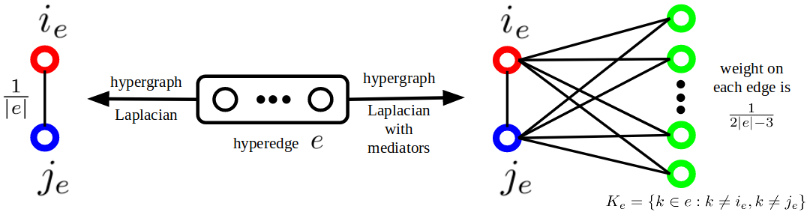

# HyperGCN: A New Method of Training Graph Convolutional Networks on Hypergraphs

[](https://nips.cc/) [](https://arxiv.org/abs/1809.02589) 

Source code for [NeurIPS 2019](https://nips.cc/) paper: [**HyperGCN: A New Method of Training Graph Convolutional Networks on Hypergraphs**](https://papers.nips.cc/paper/8430-hypergcn-a-new-method-for-training-graph-convolutional-networks-on-hypergraphs)



**Overview of HyperGCN:** *Given a hypergraph and node features, HyperGCN approximates the hypergraph by a graph in which each hyperedge is approximated by a subgraph consisting of an edge between maximally disparate nodes and edges between each of these and every other node (mediator) of the hyperedge. A graph convolutional network (GCN) is then run on the resulting graph approximation. *

### Dependencies

- Compatible with PyTorch 1.0 and Python 3.x.
- For a dataset (and/or splits) not used in the paper, please consider tuning hyperparameters such as hidden size, learning rate, seed, etc.

### Training model (Node classifiction):

- To start training run:

  ```shell
  python hypergcn.py --mediators True --split 1 --data coauthorship --dataset dblp
  ```

  - `--mediators` denotes whether to use mediators (True) or not (False) 
  - `--split` is the train-test split number
  

### Citation:

```bibtex
@incollection{hypergcn_neurips19,
title = {HyperGCN: A New Method For Training Graph Convolutional Networks on Hypergraphs},
author = {Yadati, Naganand and Nimishakavi, Madhav and Yadav, Prateek and Nitin, Vikram and Louis, Anand and Talukdar, Partha},
booktitle = {Advances in Neural Information Processing Systems (NeurIPS) 32},
pages = {1509--1520},
year = {2019},
publisher = {Curran Associates, Inc.}
}

```
